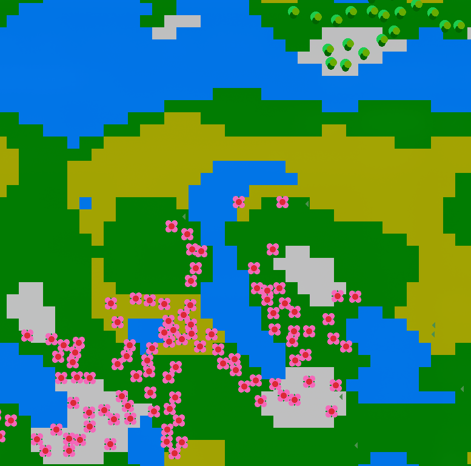

# Celular Automata System 
## Intro
This project uses automata theory to "simulate" an ecosystem. Currently there are only 3 types of plants: Flower, Tree and Weed. Their settings are easily customizable since from the `congig.json` file. <br>
This is not under any circumstances a "realistic" description of the real life.



The game is has a seed system that is between 0 and 500, this limit is arbitrary since it could have `max_int` number of seeds. Note that the seeds only affect the Tiles.
To make the speed of the game manageble the "time" goes only on **space** key press. Each "day" all plants will throw seeds in random directions. If the seed lands in a place where it can grow and has enough water, then a new plant appears, otherwise the seed is discarded. At the same time, each plant ages 1 day and weed sprouts in random places. 
<br>
The project requires [raylib](https://github.com/raysan5/raylib) and comes with 2 other libraries:
<br>
[FastNoiseLite](https://github.com/Auburn/FastNoiseLite) and [json](https://github.com/nlohmann/json) 

## Build    
There are 2 main build paths. Debug and Release. 

1. For Debug:

```
cmake -S . -B build-debug -DCMAKE_BUILD_TYPE=Debug -G "Unix Makefiles"
cmake --build build-debug -j
```
2. For Release:
```
cmake -S . -B build-release -DCMAKE_BUILD_TYPE=Release -G "Unix Makefiles"
cmake --build build-release -j
```

Alternatively there is a CMakePresets file which will do this for you using:

```
cmake --preset debug
cmake --build --preset debug -j
```
Or

```
cmake --preset release
cmake --build --preset release -j
```